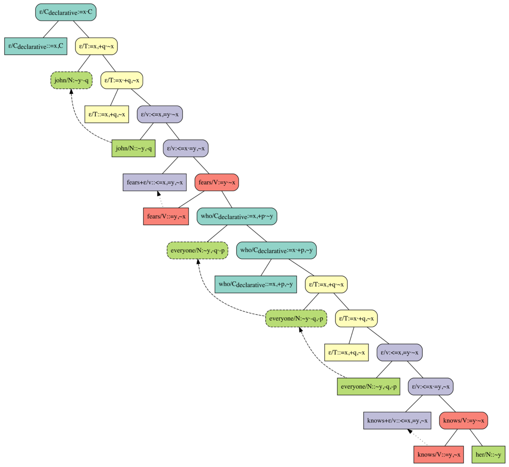

# MGSMT

MGSMT is a parser for Minimalist Grammars (MGs) that uses the [Z3 SMT-solver](https://github.com/Z3Prover/z3). If you use MGSMT, please cite the  [publication](https://aclanthology.org/2022.conll-1.12/) detailing the parser:

```
@inproceedings{indurkhya-2022-parsing,
    title = "Parsing as Deduction Revisited: Using an Automatic Theorem Prover to Solve an {SMT} Model of a Minimalist Parser",
    author = "Indurkhya, Sagar",
    booktitle = "Proceedings of the 26th Conference on Computational Natural Language Learning (CoNLL)",
    month = dec,
    year = "2022",
    address = "Abu Dhabi, United Arab Emirates (Hybrid)",
    publisher = "Association for Computational Linguistics",
    url = "https://aclanthology.org/2022.conll-1.12",
    pages = "157--175",
}
```

## Running MGSMT

To see MGSMT in action, you can run the included [Jupyter Notebook](https://github.com/indurks/mgsmt/blob/main/mgsmt-parsing-examples-CoNLL-2022.ipynb). E.g. given input consisting of an [MG lexicon](experiment-data/lexicon-G.json) and a [(sentence, meaning) pair](experiment-data/corpus-of-interface-conditions.json) for *"John fears everyone who knows her."*, the parser can generate and display the following MG derivation:



## Requirements

MGSMT requires and has been tested with the following software:
- Z3 v4.8.7 (compiled using Clang 4.0.1)
- Python v3.7.7 (compiled using Clang 4.0.1)
- PyGraphViz v1.5
- IPython v7.12.0
- pdfTeX 3.14159265-2.6-1.40.21 (TeX Live 2020)
    - Compiled with libpng 1.6.37; using libpng 1.6.37
    - Compiled with zlib 1.2.11; using zlib 1.2.11
    - Compiled with xpdf version 4.02
